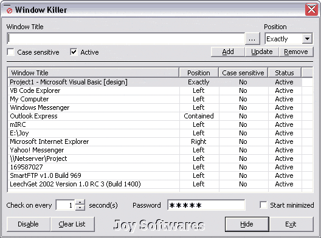



## Window Killer \[UPDATE, NOW HUGELY COMMENTED\]

### Description

Add the full/partial title in the kill list and let it do. Residing in the system tray, it immediatly closes the annoying windows from poping up on your screen. Good against popup web pages and restricting your PC from unauthorized access. Could be a better example of finding windows matching partial/case sensitive title.
 
### More Info
 

             |
---                |---
**Submitted On**   |2002-11-04 13:25:00
**By**             |[Broken Arrow](https://github.com/Planet-Source-Code/PSCIndex/blob/master/ByAuthor/broken-arrow.md)
**Level**          |Intermediate
**User Rating**    |5.0 (100 globes from 20 users)
**Compatibility**  |VB 5\.0, VB 6\.0
**Category**       |[Complete Applications](https://github.com/Planet-Source-Code/PSCIndex/blob/master/ByCategory/complete-applications__1-27.md)
**World**          |[Visual Basic](https://github.com/Planet-Source-Code/PSCIndex/blob/master/ByWorld/visual-basic.md)
**Archive File**   |[Window\_Kil1645109142003\.zip](https://github.com/Planet-Source-Code/broken-arrow-window-killer-update-now-hugely-commented__1-40550/archive/master.zip)

